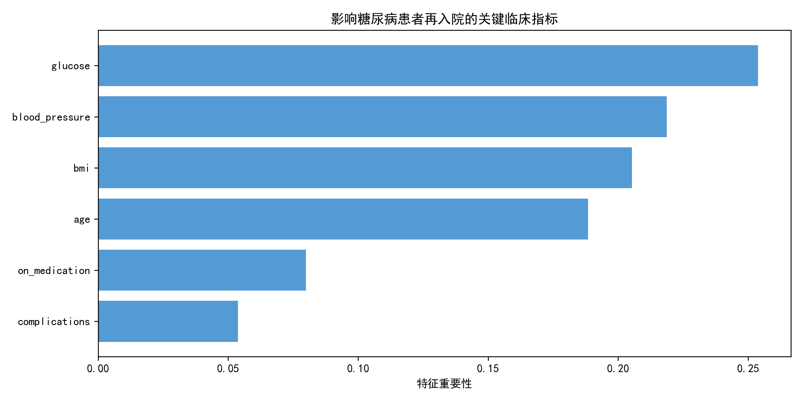

# Diabetes-readmission-risk-prediction-2026
Predicting 30-day hospital readmission risk for diabetic patients using machine learning on simulated electronic health record (EHR) data, identifying key clinical factors like glucose level, blood pressure, and BMI.
# Diabetes Readmission Risk Prediction
This project is a biomedical data science application aiming to predict 30-day hospital readmission risk for diabetic patients, demonstrating my capability in health informatics and clinical data analysis.

## Project Overview
- **Objective**: Identify key clinical factors associated with diabetes readmission and build a predictive model to support clinical decision-making.
- **Data**: Simulated electronic health record (EHR) data containing 1000 patient records with 6 clinical features (age, BMI, glucose, blood pressure, medication status, complications).
- **Methodology**: Used Python and Scikit-learn to perform data preprocessing, feature engineering, and train a Random Forest classifier. Addressed class imbalance with weighted class training.

## Key Steps
1. **Data Simulation & Preprocessing**: Generated realistic EHR data, handled missing values, and split data into training/test sets.
2. **Model Training**: Trained a Random Forest classifier, using class weights to address the inherent imbalance in clinical readmission data.
3. **Interpretability & Visualization**: Analyzed feature importance, identifying glucose level, blood pressure, and BMI as the top predictors of readmission risk.

## Visualization
The following chart shows the importance of each clinical feature in predicting readmission risk:

## Technologies Used
- Python, Pandas, NumPy
- Scikit-learn (Random Forest, train-test split, evaluation metrics)
- Matplotlib (Data visualization)
